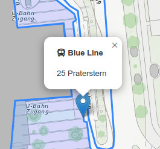
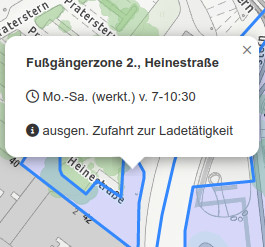
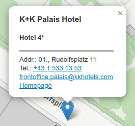

# Workload für die Wochen vom 10. April bis 8. Mai 2025

## 1. implementiert Popups beim Wien Beispiel

Implementiert nach den Vorgaben der Screenshots Popups für Haltestellen, Liniennetz, Fußgängerzonen und Hotels. Verwendet Font Awesome für die Icons sowie `tel:` und `mailto:` bei den Links für Telefonnummer und E-Mailadresse

 

 

## 2. beginnt mit dem Beispiel "Wetterstationen Euregio"

- erstellt auf github.com ein public Repo `aws`

- cloned es lokal und packt dort das Template <https://webmapping25s.github.io/templates/aws.zip> aus

- fügt alles zu GIT hinzu, committed und pushed zurück nach github.com

- stellt das `aws` Repo über die github.com Settings online

- implementiert zusätzlich Icons für die Wetterstationen mit Popups. Verwendet das vorbereitete Icon `icons/wifi.png` und zeigt den Namen der Station mit Seehöhe (z.B. "Hafelekar (2270m)") als Überschrift 4 im Popup an. Hängt die Icons in das vorbereitete Overlay für die Wetterstationen.

Bis **Donnerstag, 8. Mai 2025 um 12:00 Uhr mittags** soll alles committed, nach github.com gepushed und online erreichbar sein. Wir werden uns die Ergebnisse dann wieder ansehen und Feedback im OLAT-Kurs geben.
